# OpenMind

<p align="center">
  
</p>

Self-hosted shared memory for AI coding agents. Any MCP client (Claude Code,
Codex, Cursor, Gemini CLI, your own scripts) reads and writes one team
knowledge base: small, attributable notes instead of lost transcripts.

Status: working MVP. Requirements: [docs/REQUIREMENTS.md](docs/REQUIREMENTS.md).

## Why

Agent memory today is per-machine, per-account, per-vendor, and auto-deleted.
Two people on one project cannot see what each other's agents learned.
OpenMind keeps one fact per note, with author, tool, session and revision
history, and serves it over MCP to every agent.

## Install

```bash
go install github.com/ideanix/openmind/cmd/openmind@latest
```

or build from source:

```bash
make build      # → bin/openmind
```

## Isolation model

Sharing happens per **project**, never per user. A project is the repository
(or folder) a session runs in. Every session is pinned to one project and
cannot see another, whatever the agent asks for. On a shared server every
token also carries an explicit list of projects it may access.

## Quick start (one machine, no server)

Inside a repository:

```bash
openmind setup claude-code
# prints:  claude mcp add --scope project openmind -- /path/openmind mcp --db ~/.openmind/openmind.db --project <repo>
```

Run the printed command. Claude Code writes `.mcp.json` in the repo, the
session is pinned to that project, and notes live in `~/.openmind/openmind.db`.
Repeat in each repository you want memory for; they share one database but
never see each other's notes.

## Share with another device on your network

On the machine that holds the knowledge:

```bash
openmind token add me --projects '*'        # the server refuses to open to the network without a token
openmind service install                    # background service (launchd), listens on :7777
openmind invite laptop2 --projects logdoc   # token + ready-to-paste steps for the other device
```

`invite` prints everything the other device needs: a `curl` check, the
`claude mcp add` command with the token and the project pin, and an optional
SessionStart hook that loads the team context automatically. The other device
needs only Claude Code, not the `openmind` binary.

Tokens are stored hashed in `~/.openmind/tokens.json` and take effect without
a restart. `openmind token revoke laptop2` cuts access immediately.
Traffic on the LAN is plain HTTP; for anything beyond a home network put TLS
in front (see below).

## Control desk

```bash
openmind ui          # opens http://localhost:7777/ui signed in as the owner
```

A single embedded page, no external assets, so it works on an offline LAN.
It needs a token that holds the `*` grant.

- **Desk**: every client with its grants, whether it called in the last five
  minutes, its last action, 24-hour counters, and a 60-minute lane where each
  call is a tick: teal for reads, amber for writes, raspberry for refusals.
  Click a client to filter the live activity feed.
- **Tasks**: assign work to a client machine and read the report it sends back.
- **Notes**: browse and search what the team knows.

Every MCP tool call, REST call, refused login and cross-project attempt is
recorded with user, project, remote address and client agent.

## Agent work: assign tasks to a client machine

On the client, start a worker in the project folder:

```bash
openmind worker --server http://HOST:7777 --token <token> --dir ~/job/myrepo \
  --allow 'Bash(go test:*),Bash(git status:*),Bash(git diff:*)'
```

From the host, queue a task in the control desk or from the CLI:

```bash
openmind task add --project myrepo --to laptop2 "Add a /healthz endpoint with a test"
openmind task list
openmind task show <id>      # prompt and report
```

The worker claims the task, runs `claude -p` unattended in `--dir`, and posts
a structured report: result, what was done, files changed, how it was
verified, what is left, plus the working-tree state. Cancelling a task in the
desk stops the agent within 15 seconds.

Safety model: the worker is opt-in and runs only while its owner keeps it
running; it takes tasks only for its own token and granted projects; the
default permission mode `acceptEdits` lets the agent edit files in `--dir`
but refuses shell commands not listed in `--allow`; the preamble forbids
commits, pushes and deploys unless the task says so. `bypassPermissions`
exists for sandboxes only.

A client without a Go toolchain can fetch the binary from the server it
already trusts: `GET /download/openmind` (authenticated, same OS/arch).

## Team setup (self-hosted)

Separate teams that must not see each other get separate namespaces. Name
projects `team/repo` (the `--namespace` flag does it) and grant tokens
`team/*`. Stronger still: run one OpenMind instance per company inside its
own network; the binary is the same.

On a VPS, each token names the projects it may access (`*` = all,
`emcd/*` = a namespace):

```bash
OPENMIND_TOKENS="alice:$(openssl rand -hex 16):logdoc|openmind,bob:$(openssl rand -hex 16):logdoc" \
openmind serve --addr :7777 --db /var/lib/openmind/openmind.db
```

Each person, inside the repository, adds the server with their own token:

```bash
openmind setup claude-code --server https://mind.example.com --token <token> --namespace emcd
# prints:  claude mcp add --transport http --scope project openmind https://mind.example.com/mcp \
#            --header "Authorization: Bearer <token>" --header "X-OpenMind-Project: emcd/fiat-orc"
```

The `X-OpenMind-Project` header pins the session; the server ignores any
other project the agent names.

Put a TLS-terminating proxy (Caddy, nginx) in front; OpenMind itself speaks
plain HTTP.

## MCP tools

| Tool | Purpose |
|---|---|
| `openmind_context()` | Digest of everything the team knows about this project; call at task start. |
| `openmind_search(query, …)` | Ranked full-text search with snippets. |
| `openmind_get(id)` | Full note with provenance. |
| `openmind_list(since?, …)` | Recent changes. |
| `openmind_put(title, body, …)` | Create or update a note. Secrets are rejected. |
| `openmind_deprecate(id, reason)` | Retire a note; it stays in history. |

Tools take an optional `project` argument only in unpinned sessions (CLI,
scripts); a pinned session ignores it.

## CLI

```bash
openmind put --project logdoc --title "Tests need Redis" --tags testing \
  --body 'Run `make redis` before `go test ./...`. **Why:** the queue layer is not mocked.'

openmind search  --project logdoc redis
openmind context --project logdoc
openmind import claude-code --project logdoc          # from ~/.claude/projects/<cwd>/memory
openmind export claude-md   --project logdoc --out CLAUDE.md   # idempotent, between markers
```

Point the CLI at a server with `--server URL --token T` or
`OPENMIND_SERVER` / `OPENMIND_TOKEN`; without them it uses the local database.

## REST API

All endpoints take `Authorization: Bearer <token>` when tokens are configured.

```
GET    /api/v1/notes?project=&q=&type=&tags=&since=&status=&limit=
POST   /api/v1/notes                 {project,title,body,type,scope,tags,id?}
GET    /api/v1/notes/{id}
GET    /api/v1/notes/{id}/history
DELETE /api/v1/notes/{id}?reason=    (deprecate)
GET    /api/v1/projects
GET    /api/v1/projects/{project}/context
GET    /api/v1/whoami
GET    /api/v1/tasks?project=&assignee=&status=
POST   /api/v1/tasks                 {project,assignee,title?,prompt}
POST   /api/v1/tasks/claim           worker: next queued task or 204
POST   /api/v1/tasks/{id}/heartbeat  worker: {"continue":false} once cancelled
POST   /api/v1/tasks/{id}/report     worker: {status: done|failed, report}
POST   /api/v1/tasks/{id}/cancel | requeue
GET    /api/v1/admin/overview | clients | activity     ("*" grant only)
GET    /ui                           control desk
POST   /mcp                          MCP Streamable HTTP
```

## Note format

Markdown with YAML frontmatter, a superset of Claude Code's auto-memory
files, so existing memory folders import unchanged:

```markdown
---
id: 01a0aef1b6336fa7086a
title: API tests need local Redis
type: project          # user | feedback | project | reference | decision
scope: project         # personal | project | team
project: logdoc
tags: [testing, redis]
author: alice
source: {tool: claude-code, session: 5de3c033-…}
status: active
---
Run `make redis` before `go test ./...`.
**Why:** the queue layer is not mocked.
```

## Roadmap

See [docs/REQUIREMENTS.md](docs/REQUIREMENTS.md) §10. Next: `openmind init`,
two-way sync with Claude Code memory, hooks plugin, roles, web UI, Docker image.

## License

Apache-2.0.
